# 新华路真实建筑模型对照表

更新时间：2026-07-17

## 阅读说明

- 左侧是已经保存到项目内的真实照片，右侧是从当前网页系统实际运行场景中截取的画面，不使用 Blender 预览图。
- 系统截图统一使用 1280 × 720 画布，并将第三人称相机调整到接近街面的人眼高度。
- “角度匹配”用于区分真正可直接比较的视角与只能比较局部特征的视角：
  - **A**：同一立面、观察方向基本一致。
  - **B**：同一立面或同一建筑侧面，但拍摄距离、焦段或横向偏移不同。
  - **C**：公开照片只覆盖入口、院落或建筑群局部，暂时不能作为严格同机位对照。
- 新华别墅 211 弄与 329 弄是两个真实落地点，但当前系统复用同一个 `xinhua-villas.glb`。本表保留两行，便于直接判断模型复用是否合理。
- 公开照片仅作为内部建模与效果核对证据，不作为运行时纹理。转载或公开发布前仍需按来源页面确认图片授权。

## 对照表

<table>
  <thead>
    <tr>
      <th style="width: 15%">建筑与复现入口</th>
      <th style="width: 36%">真实照片</th>
      <th style="width: 36%">系统实际截图</th>
      <th style="width: 13%">角度与检查重点</th>
    </tr>
  </thead>
  <tbody>
    <tr>
      <td>
        <strong>上海影城</strong> 
        新华路 160 号 
        <a href="http://127.0.0.1:3002/?start=cinema">系统入口</a> 
        <code>shanghai-cinema.glb</code>
      </td>
      <td>
        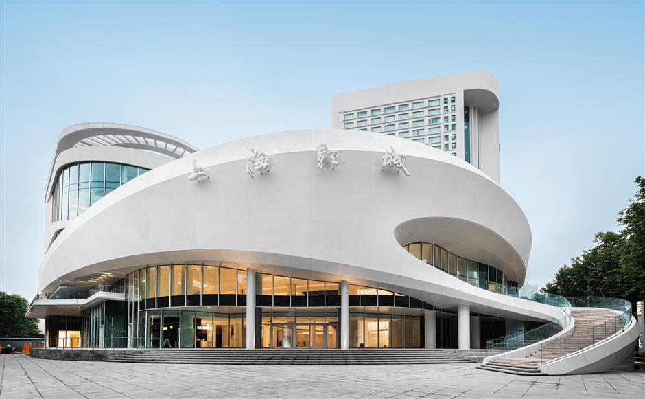 
        来源：<a href="https://www.meet-in-shanghai.net/en/news/renovated-cinema-to-reopen-in-time-for-siff-203526/">上海市文旅推广网 / SHINE</a>
      </td>
      <td>
        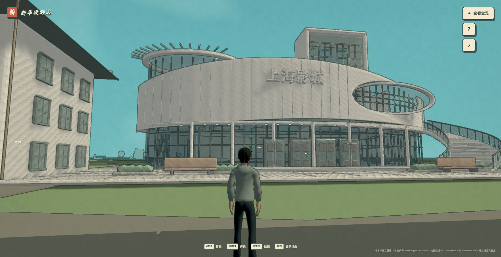 
        入口参数：<code>?start=cinema</code>；2026-07-21 实际 Three.js 页面验收
      </td>
      <td>
        <strong>A</strong> 
        正面略偏左视角。连续白色丝带、右侧椭圆开洞、右侧宽弧形楼梯、左侧玻璃鼓体和后塔楼均可一眼对应；运行时采用更低的街平视角，因此不要求透视完全重合。
      </td>
    </tr>
    <tr>
      <td>
        <strong>上海电影艺术中心</strong> 
        新华路 200 号 
        <a href="http://127.0.0.1:3002/?start=film-art">系统入口</a> 
        <code>film-art-center.glb</code>
      </td>
      <td>
        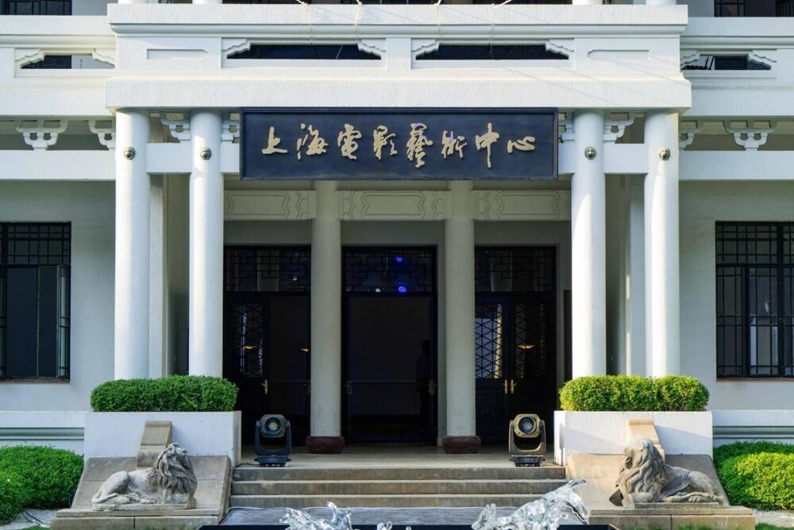 
        来源：<a href="https://www.prnewswire.com/apac/news-releases/fod-and-shanghai-film-art-center-debut-as-cultural-hub-amidst-26th-shanghai-international-film-festival-302175363.html">PR Newswire</a>
      </td>
      <td>
        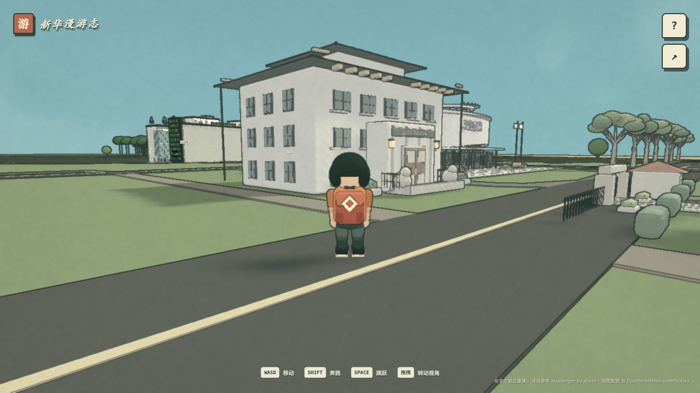 
        入口参数：<code>?start=film-art</code>
      </td>
      <td>
        <strong>B</strong> 
        真实照片为正门近景，系统为右前方远景。重点比较中轴门廊、柱列、牌匾、屋檐层次和窗洞节奏。
      </td>
    </tr>
    <tr>
      <td>
        <strong>一尺花园（安和花园店）</strong> 
        新华路 179 弄 
        <a href="http://127.0.0.1:3002/?start=garden179">系统入口</a> 
        <code>one-step-garden.glb</code>
      </td>
      <td>
        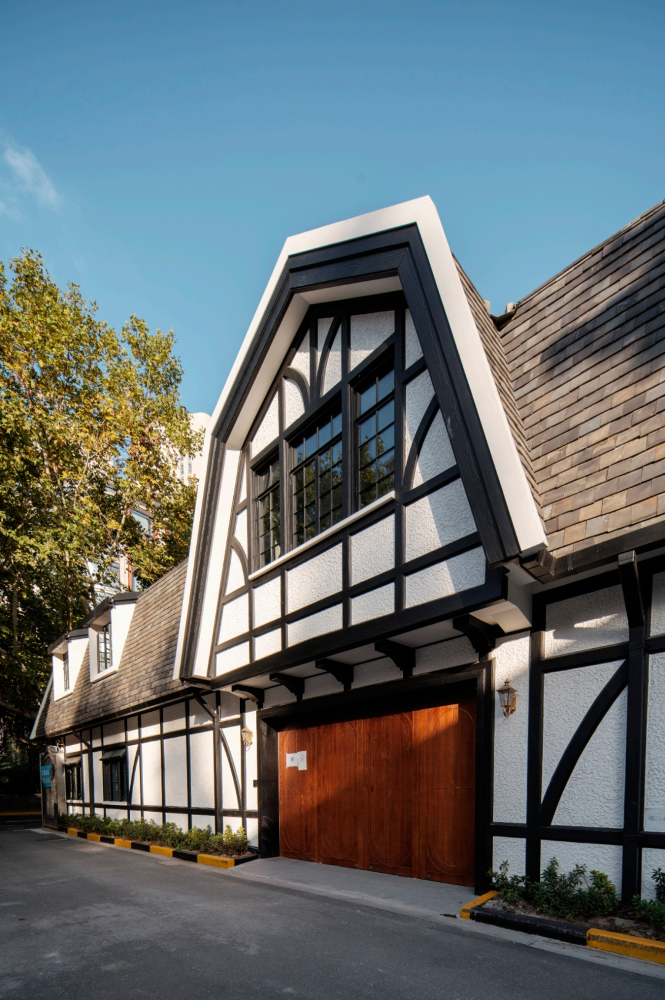 
        来源：<a href="https://www.jfdaily.com/sgh/detail?id=1697461">上观新闻</a>
      </td>
      <td>
        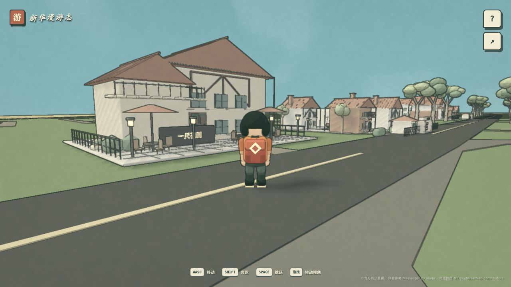 
        入口参数：<code>?start=garden179</code>
      </td>
      <td>
        <strong>B</strong> 
        同为半木构山墙方向，真实照片焦段更窄且仰拍。重点比较陡坡屋顶、黑色木构线条、门窗比例和后期加建体量。
      </td>
    </tr>
    <tr>
      <td>
        <strong>新华别墅 211 弄</strong> 
        新华路 211 弄 
        <a href="http://127.0.0.1:3002/?start=villas">系统入口</a> 
        <code>xinhua-villas.glb</code>
      </td>
      <td>
        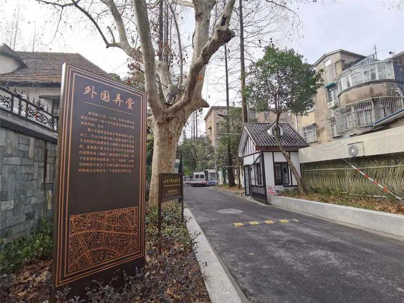 
        来源：<a href="https://www.thepaper.cn/newsDetail_forward_28954961">澎湃新闻</a>
      </td>
      <td>
        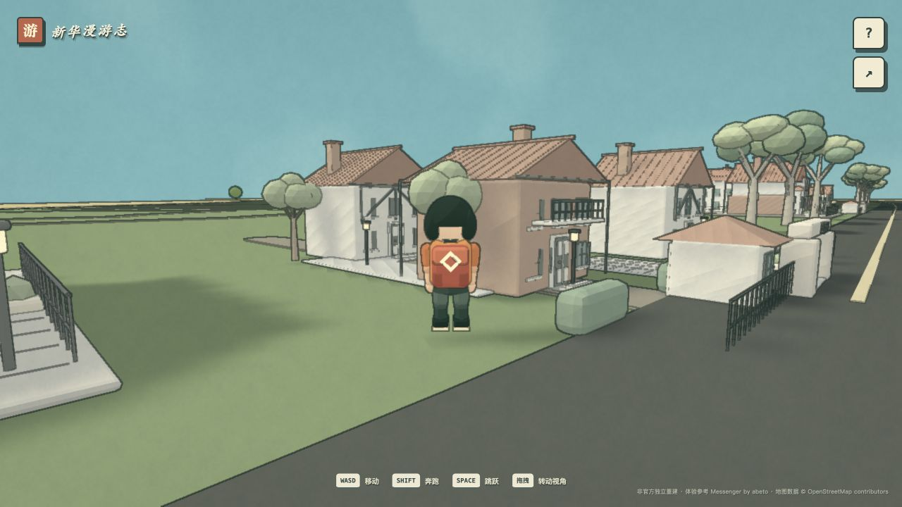 
        入口参数：<code>?start=villas</code>
      </td>
      <td>
        <strong>C</strong> 
        公开照片主要展示弄堂入口，系统展示建筑群。当前可比较入口尺度、弄道宽度和门房；别墅单体仍需补同机位照片。
      </td>
    </tr>
    <tr>
      <td>
        <strong>新华别墅 329 弄</strong> 
        新华路 329 弄 
        <a href="http://127.0.0.1:3002/?start=villas329">系统入口</a> 
        <code>xinhua-villas.glb</code>（复用）
      </td>
      <td>
        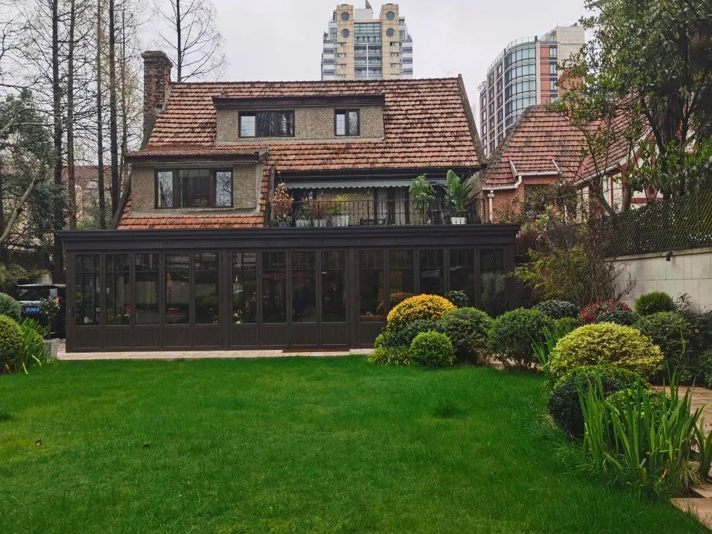 
        来源：<a href="https://www.thepaper.cn/newsDetail_forward_28954961">澎湃新闻</a>
      </td>
      <td>
        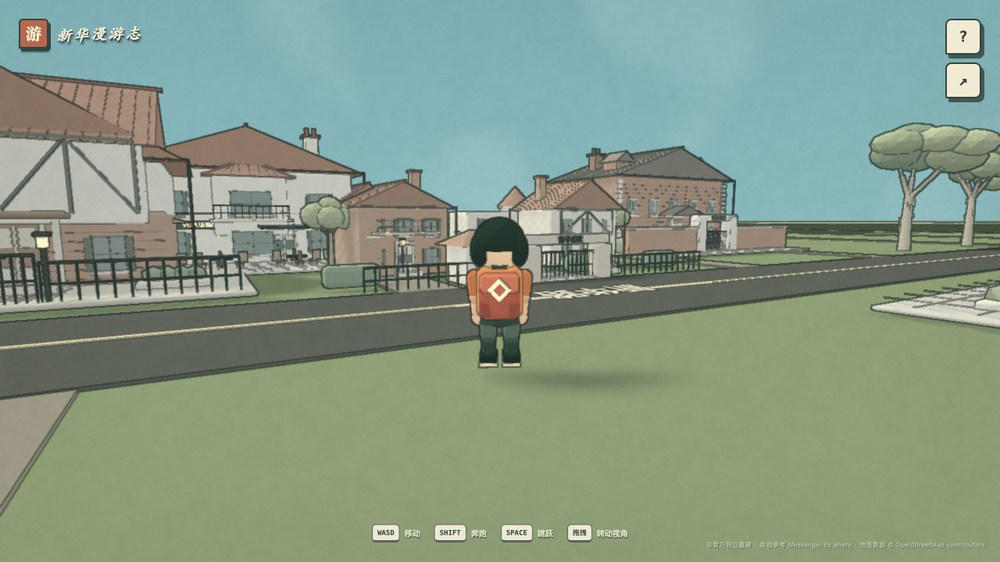 
        入口参数：<code>?start=villas329</code>
      </td>
      <td>
        <strong>B</strong> 
        同为花园侧正面方向，但报道未给照片标注具体门牌。重点检查屋顶组合、阳光房、花园尺度以及复用模型是否过于雷同。
      </td>
    </tr>
    <tr>
      <td>
        <strong>新华路 315 号住宅</strong> 
        新华路 315 号 
        <a href="http://127.0.0.1:3002/?start=house315">系统入口</a> 
        <code>house-315.glb</code>
      </td>
      <td>
        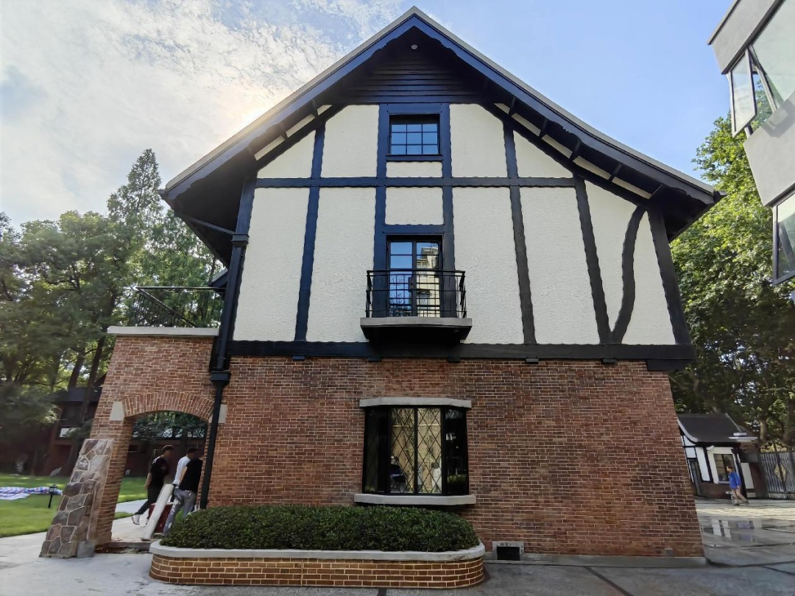 
        来源：<a href="https://www.jfdaily.com/sgh/detail?id=1697461">上观新闻</a>
      </td>
      <td>
        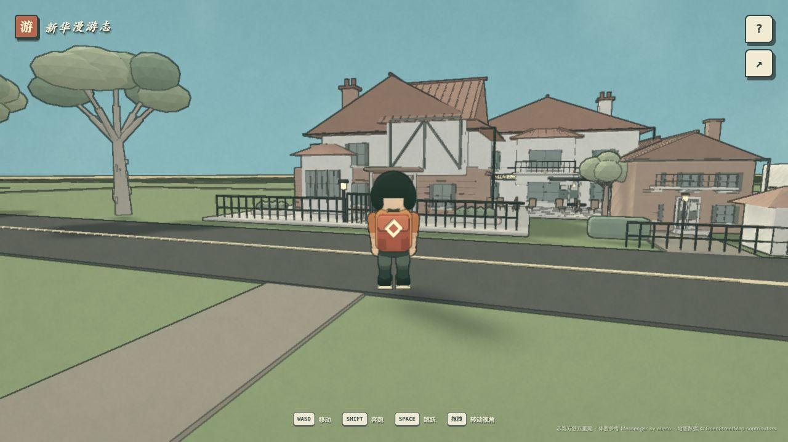 
        入口参数：<code>?start=house315</code>
      </td>
      <td>
        <strong>B</strong> 
        真实照片是山墙正面近景，系统是街对面全景。重点比较半木构山墙、红砖首层、凸窗、陡坡屋顶和烟囱位置。
      </td>
    </tr>
    <tr>
      <td>
        <strong>Villa Le Bec</strong> 
        新华路 321 号 
        <a href="http://127.0.0.1:3002/?start=villa-le-bec">系统入口</a> 
        <code>villa-le-bec.glb</code>
      </td>
      <td>
        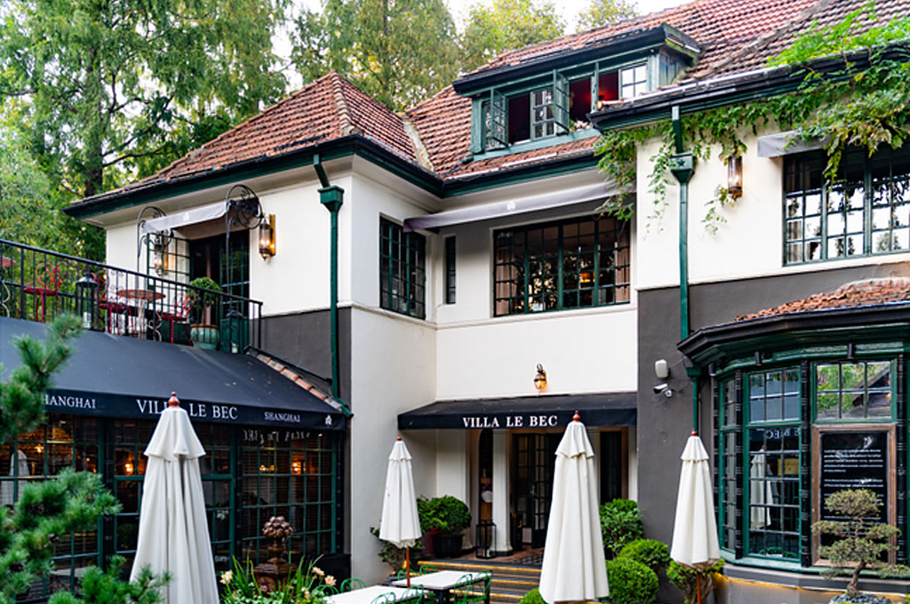 
        来源：<a href="https://shanghai-zine.com/listings/16308/">Shanghai-Zine</a>
      </td>
      <td>
        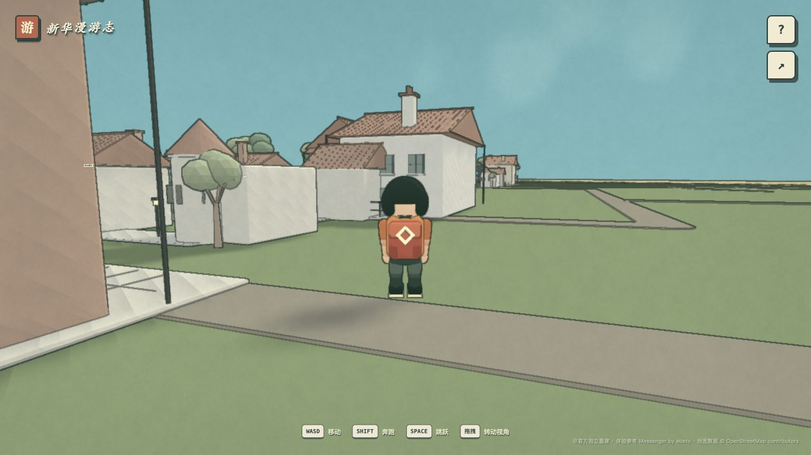 
        入口参数：<code>?start=villa-le-bec</code>
      </td>
      <td>
        <strong>A</strong> 
        院落正面方向。重点比较白墙、深绿窗框、老虎窗、凸窗、黑色雨棚和庭院桌椅。
      </td>
    </tr>
    <tr>
      <td>
        <strong>上海民族乐团</strong> 
        新华路 336 号 
        <a href="http://127.0.0.1:3002/?start=orchestra">系统入口</a> 
        <code>shanghai-orchestra.glb</code>
      </td>
      <td>
        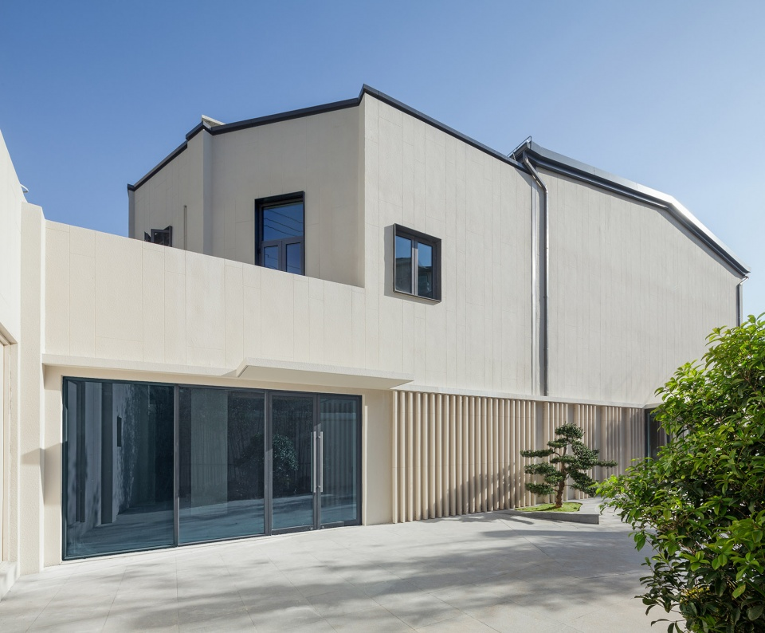 
        来源：<a href="https://www.gooood.cn/renovation-project-of-shanghai-chinese-orchestra-located-at-no-336-xinhua-road-phase-i-china-by-tjad.htm">gooood / TJAD</a>
      </td>
      <td>
        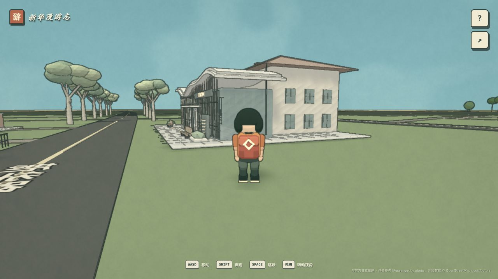 
        入口参数：<code>?start=orchestra</code>
      </td>
      <td>
        <strong>B</strong> 
        同为院落右前方方向，真实照片更靠近改造建筑。重点比较浅色墙体、折线屋面、竖向格栅和玻璃入口。
      </td>
    </tr>
    <tr>
      <td>
        <strong>新华公馆</strong> 
        新华路 365 弄 2 号楼 
        <a href="http://127.0.0.1:3002/?start=xinhua365">系统入口</a> 
        <code>xinhua-mansion.glb</code>
      </td>
      <td>
        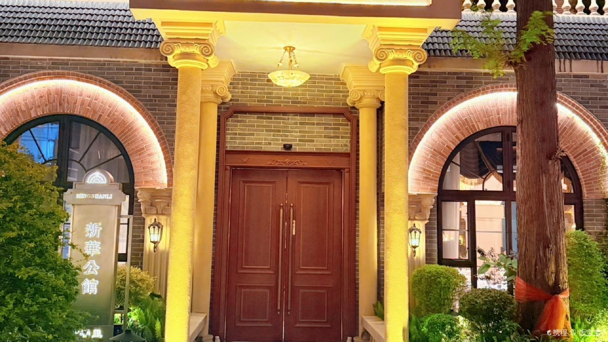 
        来源：<a href="https://hk.trip.com/restaurant/china/shanghai/detail/restaurant-149665927/">Trip.com 餐厅页面</a>
      </td>
      <td>
        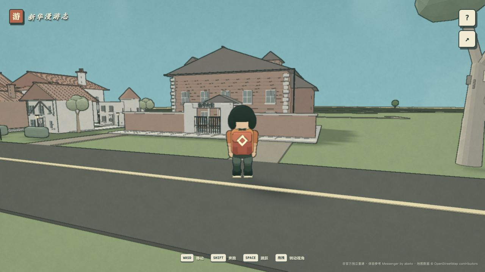 
        入口参数：<code>?start=xinhua365</code>
      </td>
      <td>
        <strong>C</strong> 
        真实照片仅覆盖入口正面，系统展示整栋建筑。当前可比较清水砖、拱窗、柱式门廊和入口灯光；整体体量仍需补外观全景。
      </td>
    </tr>
  </tbody>
</table>

## 当前结论

- 已完成 8 个独立 GLB、9 个实际落地点的运行时截图归档。
- **可直接比较（A）**：上海影城、Villa Le Bec。
- **方向一致但机位仍有偏差（B）**：上海电影艺术中心、一尺花园、新华别墅 329 弄、新华路 315 号、上海民族乐团。
- **需要继续补真实同机位照片（C）**：新华别墅 211 弄、新华公馆。
- 这张表只记录当前事实，不表示模型已经达到真实还原标准。后续修改时应优先处理 A/B 级对照中一眼可见的轮廓、比例、门窗节奏和标志性构件差异。
