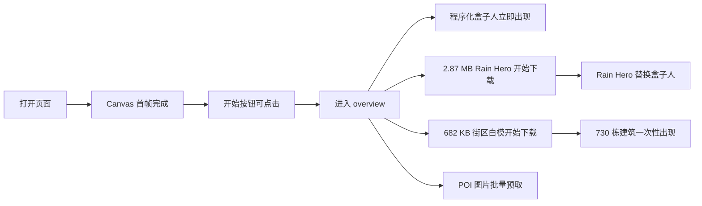
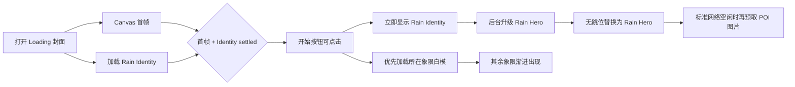

# Loading Experience Optimization Plan

## 1. 目标与范围

本轮只解决“从封面进入可玩世界”的首轮加载体验，不新增 POI，也不改变角色控制、碰撞、相机和地图坐标。

核心目标：

1. 点击“开始漫游”后不再必然看到盒子人。
2. 弱网下先得到可识别、可动画的 Rain Identity，再异步升级为 Rain Hero。
3. 开始按钮只在首帧渲染器和 Rain Identity 都已成功加载，或 Identity 已明确失败并切换到程序化保险层后出现。
4. 首轮网络只争抢“可玩所需资源”，POI 图片延后。
5. 730 栋街区白模按空间分块渐进出现，不再等待单一 GLB 全部下载完成。
6. 封面使用视觉等价的派生 JPEG：移动端从约 `657 KB` 降到约 `266 KB`，
   桌面端从约 `520 KB` 降到约 `297 KB`；原图保留。

明确不做：

- 不用模糊、淡入或遮挡掩盖加载状态。
- 不把参考图片嵌入运行时 GLB。
- 不删除现有 Rain Hero、旧人物或单文件街区白模；它们保留为回滚点。
- 不发布到 Sites 或 VPS。本轮交付为本地实现、测试数据与可审查分支。

## 2. 当前流程与基线

### 2.1 当前实际流程

当前开始按钮只依赖 Canvas 首帧；Rain 直到点击以后才开始下载。`Suspense` 的程序化人物不是偶发故障，而是每次冷启动都会出现，只是在快网下停留时间很短。街区白模虽然内部已经按四象限和三个高度带组织为 12 个 mesh，但它们封装在一个 GLB 中，浏览器必须等完整文件后才能解析和显示。

### 2.2 同条件弱网基线

协议：

- 视口：`390 × 844`
- 下载：`1.6 Mbps`
- 上传：`0.75 Mbps`
- 额外延迟：`150 ms`
- HTTP cache：关闭
- 构建：生产静态构建
- 页面可见性：前台可见

观测：

| 指标 | 当前基线 |
| --- | ---: |
| 开始按钮可点击 | 约 `3.6 s`，波动时约 `5.2 s` |
| 点击后程序化人物出现 | 约 `0.7 s` |
| 街区白模完整出现 | 点击后约 `21.0 s` |
| Rain Hero 出现 | 点击后约 `32.0 s` |
| Rain Hero 体积 | `2,873,644 B` |
| 街区单 GLB 体积 | `682,104 B` |
| 首轮本地 POI 缩略图 | `17` 张，合计 `1,546,485 B` |

这解释了测试者感受到的“人物先坏掉、建筑后补出来”：人物、建筑与图片在点击后同时争抢有限带宽，且两个 3D 状态都以整包完成为显示条件。

## 3. 目标流程

### 3.1 三级人物合同

| 层级 | 用途 | 网络依赖 | 目标 |
| --- | --- | --- | --- |
| Rain Hero | 最终画质 | 需要 | 保留现有 56,094 triangles / 2.87 MB 资产 |
| Rain Identity | 开场与弱网状态 | 需要，但在开始前加载 | 保留 Rain 轮廓、配色、骨骼和 Idle/Walk/Run |
| Procedural Rain | 请求失败的保险层 | 不需要 | 改成 Rain 配色与低马尾轮廓，不再是中性盒子人 |

切换规则：

- Identity 成功：开始按钮解锁；进入世界第一帧直接使用 Identity。
- Identity 失败：程序化 Rain 保险层解锁开始按钮，不让网络故障卡死用户。
- Hero 成功：在同一根角色 Group、同一比例和动画语义下替换 Identity。
- Hero 失败：Identity 持续可玩，错误边界不影响世界其他内容。

## 4. Rain Identity 模型 Brief

### 4.1 Scope

- Asset slug: `rain-summer-wanderer-identity`
- Type: character / Identity runtime tier
- Runtime component: `app/scene/rain-lite-wanderer-character.tsx`
- Generator: `scripts/create_rain_lite_character.py`
- Editable source: `assets/models/source/character/rain-summer-wanderer-identity.blend`
- Runtime GLB: `public/models/character/rain-summer-wanderer-identity.glb`
- Single-asset build:
  `/Applications/Blender.app/Contents/MacOS/Blender --background --python scripts/create_rain_lite_character.py`
- GLB audit:
  `python3 scripts/audit_glb.py public/models/character/rain-summer-wanderer-identity.glb --forbid-images --max-nodes 80`

### 4.2 Preflight

- Blender: `5.2.0 LTS`
- Hero baseline SHA: `45d2d21d231550d3d94a80c805f8e08c2d4b430f6d42d6cdce74f34e5f135805`
- Hero baseline: `56,094` triangles、`76` nodes、`13` meshes、`11` materials、`0` images、`1` skin、3 animations。
- 本地预览：项目现有静态预览命令与真实 `/?start=` 入口。
- Browser QA: 真实移动端视口、弱网 CDP 限速、console 与 resource timing。
- Blender MCP 后台服务不可用时，回退到可重复的固定机位 headless render；不依赖临时鼠标修改。

### 4.3 参考证据与覆盖矩阵

| 槽位 | 本地证据 | 回答的问题 | 状态 |
| --- | --- | --- | --- |
| canonical | `docs/research/assets/character-references/rain-v1-rig-preview.png` | 头身、发型、服装、面部 | 已覆盖 |
| side / motion | `docs/research/assets/character-references/rain-animation-showcase.jpg` | 侧向深度、四肢与动画 | 已覆盖 |
| production canonical | `test_artifacts/test_rain_summer_character_canonical.png` | 已验收派生版正面轮廓 | 已覆盖 |
| production side | `test_artifacts/test_rain_summer_character_side.png` | 已验收派生版侧面轮廓 | 已覆盖 |
| runtime scale | `test_artifacts/test_rain_production_local_mobile.jpg` | 第三人称屏占比和地面接触 | 已覆盖 |

Canonical comparison view：沿角色正面略偏右的固定三分之四视角，与现有 `test_rain_summer_character_canonical.png` 相同；运行时继续使用视觉 scale `1.3`。

Observed：

- 低马尾与发圈、深色主发、暖色皮肤、青绿围巾、奶油色无袖上衣、蓝色牛仔裤和棕色鞋是当前生产 Rain 的可见身份。
- 现有 GLB 无图片贴图，身份主要来自轮廓、材质色块和面部几何。
- 现有 Idle/Walk/Run、骨架与脚部权重已通过真实页面验收。

Inferred：

- 第三人称常规距离下，局部面部拓扑和鞋底细分的辨识贡献低于轮廓、发型与服装色块，可优先减面。
- 保留相同骨架、动作名、bounds 和视觉 scale，可以让 Identity → Hero 切换不改变控制与相机合同。

Unknown：

- 不同移动 GPU 的着色编译时间无法只从资产体积推断，因此必须用真实生产构建和同条件浏览器测量。
- 弱网的 RTT/带宽会抖动，最终结论使用多次采样的中位趋势，不把单次最低值当保证值。

### 4.4 Identity 质量合同

独有识别构件：

1. 贴近后颈的短低马尾和暖红发圈。
2. 青绿色围巾与奶油色无袖上衣的上身色块。
3. 蓝色牛仔裤、棕色鞋和 Rain 原有成人卡通头身比例。

预算：

| 项目 | 上限 |
| --- | ---: |
| triangles | `9,000` |
| nodes | `80` |
| meshes | `13` |
| materials | `11` |
| images | `0` |
| GLB bytes | `650,000` |
| skin | `1` |
| animations | `Idle_Neutral`、`Walk`、`Run` |

Identity 不参与独立碰撞；角色继续使用现有 `PLAYER_RADIUS`、地图碰撞和相机逻辑。减面不允许改变脚底高度、角色 bounds 或动画骨骼命名。

### 4.5 批次与验收

| 批次 | 交付 | Blender/GLB 检查 | Three.js 检查 |
| --- | --- | --- | --- |
| Identity graybox | Hero 派生减面版 | canonical / side 轮廓、bounds | 同位置、同 scale、无跳位 |
| Animation | 保留 skin 和三动作 | clips、权重、脚底 | Idle/Walk/Run 可切换 |
| Runtime integration | Identity → Hero | SHA、预算、缓存版本 | 弱网下点击后不出现盒子人 |
| Final insurance | 程序化 Rain | 无网络请求 | Identity 请求失败仍可开始 |

## 5. 街区白模分块

生成器继续使用现有 730 条建筑证据与 12 个逻辑 mesh，但额外导出四个空间 GLB：

- `east-south`
- `east-north`
- `west-south`
- `west-north`

每个文件包含该象限的 low / mid / high 三个 mesh。运行时根据起始位置把所在象限设为首块，其余块按与玩家距离排序进入独立 `Suspense` 和错误边界。某块失败只缺失该象限，不再让 730 栋一起失败。

## 6. 请求优先级

首轮优先级：

1. HTML / JS / CSS、Canvas 首帧。
2. Rain Identity。
3. 进入位置所在象限白模。
4. Rain Hero。
5. 其余白模象限。
6. 当前真正靠近的 POI 图片。
7. 标准网络且 Hero 已完成后，才空闲预取剩余 POI 图片；弱网不做批量预取。

## 7. 验收指标

必须满足：

- 点击后首个角色 tier 为 `identity`，Identity 请求失败测试时才允许 `procedural`。
- 弱网下不出现旧中性盒子人。
- Identity 通过体积、结构、动画与固定机位视觉检查。
- 起始象限建筑先于全街区完成显示。
- 弱网首轮不发起 17 张 POI 图片批量请求。
- console 无新增错误；`npm test`、`npm run lint`、生产构建通过。
- 用与基线相同的 `390 × 844 / 1.6 Mbps / 150 ms / cache off` 协议输出 A/B 数据和截图。

## 8. 决策日志

### Iteration 1

- 决策：不把开始按钮等到 2.87 MB Hero；只等可玩必需的 Identity。
- 原因：Hero 前置会把弱网等待整体搬到封面，虽消除盒子人，但开始时间会过长。
- 决策：程序化人物保留为失败保险层，而不是常规加载层。
- 原因：网络失败仍需可玩，但正常冷启动不应让用户看到“错误形态”。
- 决策：复用已验收 Rain 源资产派生 Identity，不引入第二个风格不一致的人物。
- 回滚：现有 Hero GLB、旧程序化组件和单文件街区 GLB 均保留在 Git 历史与原路径。

## 9. 实施结果

### 9.1 资产结果

| 资产 | 原状态 | 新状态 | 变化 |
| --- | ---: | ---: | ---: |
| Rain 可玩首层 | Hero `2,873,644 B` / `56,094` tris | Identity `621,308 B` / `8,377` tris | bytes `-78.4%`、tris `-85.1%` |
| 移动封面 | 约 `657 KB` | 约 `266 KB` | `-59.5%` |
| 街区首个可见包 | 单 GLB `682,104 B` | 起点块 `131,784 B` | 首块 `-80.7%` |
| 街区失败范围 | 730 栋一起失败 | 单象限独立失败 | 故障隔离到 1/4 街区 |

Identity 最终 SHA 为
`f0075bba06a04106ecbe9121e53f7f4d56304224320536bf2780ff14c3594c58`。
同一生成器重复执行得到相同 SHA。GLB 审计为 76 nodes、13 meshes、
11 materials、0 images、1 skin，保留 Idle/Walk/Run。

视觉证据：

- `test_artifacts/test_rain_identity_canonical.png`
- `test_artifacts/test_rain_identity_side.png`
- `test_artifacts/test_rain_identity_three_way_comparison.png`
- `test_artifacts/test_loading_weak_comparison.png`

### 9.2 同条件弱网 A/B

最终复测继续使用：

- `390 × 844`
- `1.6 Mbps` 下行、`0.75 Mbps` 上行
- `150 ms` 额外延迟
- HTTP cache disabled
- production static build，页面前台可见

| 指标 | 当前基线 | 优化后 | 结论 |
| --- | ---: | ---: | --- |
| 开始按钮 | 约 `3.6 s`，波动约 `5.2 s` | `7.3 s` | 多等约 `3.7 s`，但等待被放在语义正确的 Loading 内 |
| 点击后首个人物 | 程序化盒子人，约 `0.7 s` | Rain Identity，采样 `0 ms` | 常规冷启动不再出现盒子人 |
| 首块街区白模 | 约 `21.0 s` 才整包出现 | `4.6 s` | 约提前 `78%` |
| 全街区白模 | 约 `21.0 s` | `10.1 s` | 约提前 `52%` |
| Rain Hero | 点击后约 `32.0 s` | 点击后 `22.8 s` | 约提前 `29%` |
| 弱网 POI 批量预取 | 17 张，本地约 `1.55 MB` | 0 张批量；只请求实际靠近的 1 张 `132 KB` 图片 | 不再与人物和建筑抢首轮带宽 |
| 正常路径 console error | `0` | `0` | 无新增错误 |

故障注入：

- 强制阻断 Identity GLB 后，开始按钮约 `3.3 s` 解锁。
- 点击后 `0 ms` 显示程序化 Rain 保险层，页面没有卡死。
- 阻断请求本身会在 DevTools 产生预期的 fetch exception；正常路径无该错误。

原始优化版数据：

- `test_artifacts/test_loading_optimized_weak_cover_final_metrics.json`
- `test_artifacts/test_loading_optimized_identity_failure_metrics.json`
- `test_artifacts/test_loading_comparison.json`

### 9.3 自动验收

- `npm test`：`194/194` passed，包含 static 与 Sites production build。
- `npm run lint`：passed。
- Identity GLB audit：passed。
- 街区单文件与四分块确定性重放：passed。
- 正常弱网路径：Identity → Hero，未观测到 procedural tier。
- Identity 阻断路径：procedural insurance 可玩。

## 10. 最终结论

本轮已经把“像 bug 的异步补丁过程”改成了明确的渐进加载：

1. Loading 内准备轻量人物；
2. 点击后立即看到形状、配色、动作都与最终 Rain 一致的 Identity；
3. 建筑按象限一部分一部分出现；
4. Hero 和非必要图片不再同时阻塞首轮体验；
5. 真正断网时仍有 Rain 风格的零请求保险层。

这不是让所有资源在弱网下瞬间完成，而是把不可控的资源完成顺序改成用户能理解的产品顺序。当前最大的可见问题——常规冷启动先出现丑盒子人、长时间没有街区白模——已经消除。

### 10.1 白模跨模式闪烁补充修复

慢网复测发现，街区白模原先只在 `overview` 模式挂载。点击“开始”时，
旧的封面简模先切换，而四块街区 GLB 此时才开始挂载，形成“白模消失、地图短暂变空、
再逐块出现”的视觉断层。

修复后，街区白模在 `intro` 阶段即挂载并开始加载；从封面进入全览时复用同一个
React / Three.js 实例，不再重新创建。进入 `explore` 时只把父组设为不可见而不卸载，
返回全览可直接恢复已加载白模。

逐帧验收还发现：人物开始上报位置后，焦点数组引用变化会重启分块排序定时器；旧实现
即使已经显示四块，新的第一个定时器仍会把 `activeCount` 写回 `2`，造成两片白模真实
卸载后再恢复。修复后，加载顺序只在组件首次挂载时按出生点确定，且 `activeCount`
只能单调增加、不能倒退。Explore 仍由不可见父组整体跳过，因此不增加详情态 draw call。

明确代价是开始按钮在本次极弱网协议下从约 `3.6 s` 延后到 `7.3 s`。这是有意选择：把约 `3.7 s` 的人物准备放进 Loading，换取进入后立即正确。若后续真实用户数据仍认为 7 秒过长，下一阶段应优化 JS/GLTF 解析器启动成本或为 Identity 使用 Meshopt/Draco 的本地解码方案；不建议重新允许盒子人进入正常路径。
