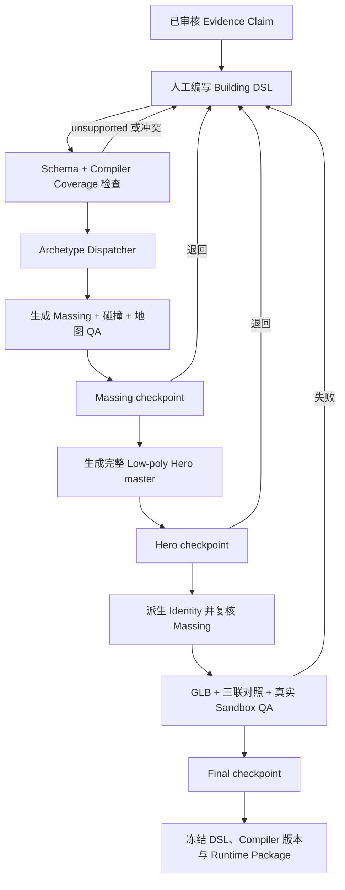
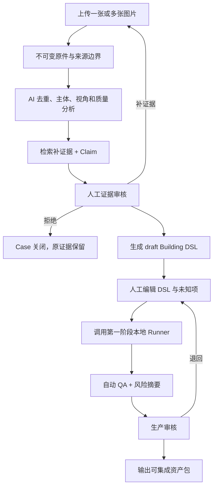

# 新华漫游建筑引擎：第一、二阶段方案（V2）

- Status: Compiler-first proposal for joint validation
- Scope: 第一阶段“建筑引擎内核”与第二阶段“证据辅助内部工作台”
- Product surface: 第一阶段使用本地 CLI 与真实游戏 Sandbox；第二阶段再扩展现有
  `/asset-library`
- Required input: 第一阶段使用已审核的既有证据与人工 DSL；第二阶段对操作者唯一
  必填内容是图片证据
- Formal review types: 证据审核、生产审核
- Core bet: 不修改生成器代码，只修改 Building DSL，即可稳定生产同类新建筑
- Out of scope: 公开投稿、社区账号体系、分布式 Worker、无人审核自动发布、全街区
  一键生成

## 1. 结论

本方案保留“图片是证据、Building Case 是血缘容器”的方向，但把实施重心从平台建设
转向建筑生产内核。第一阶段先证明：

```text
Evidence Claim
  → 可执行 Building DSL
  → Archetype Compiler
  → 可编辑 Blender master
  → 同源 Runtime Package
  → 真实 Three.js Sandbox
```

只有五栋、至少三类建筑证明该链路能稳定工作，才进入第二阶段：

```text
上传图片
  → 系统补充 Claim
  → 生成 draft DSL
  → 人工修正
  → 本地 Runner 编译
  → 自动 QA
  → 人工对照审核
  → 可集成资产包
```

`Building Spec` 不再是描述性 metadata，而是唯一的可执行 `Building DSL`。数据库、
上传、任务队列和浏览器 Agent 都不能早于编译器成为主线。

后台只保留两类人工审核：

1. **证据审核**：判断现有证据是否足以支持生产，以及哪些内容仍是未知；
2. **生产审核**：使用同一个 Compare 工作台完成三个必要检查点：
   - `Massing checkpoint`：在身份细化前比较证据、体块和真实地图；
   - `Hero checkpoint`：完整 Hero master 先通过固定机位/MCP2，再允许派生 Identity；
   - `Final checkpoint`：比较图片证据、三级同机位成品和真实游戏 Sandbox。

这三个生产检查点共享界面、字段和审核记录，不拆成三套流程。Blender MCP 是需要
视觉诊断时的工具；固定机位、Massing 地图结果、三档对照和运行指标由引擎自动
准备，但人工仍要在 Massing、Hero 和 Final 三个关键时刻作出版本化结论。

## 2. 第一、二阶段边界

### 第一阶段：建筑引擎内核

目标是证明“同一种建筑语法能够生产多个不同建筑”，而不是先建设管理平台。

第一阶段交付：

- 一个版本化、可校验、可执行的 `Building DSL v0`；
- 一个 Archetype Registry，首批至少覆盖规则独栋/花园住宅、里弄/沿街建筑和
  公共/Hybrid 建筑三类；
- 每个 archetype 独立的生成模块、支持字段清单和失败诊断；
- 一套包含比例、轮廓夸张、立面节奏、构件厚度、共享材质和禁止细节的
  `Art Profile`；
- 一个支持 `--asset` 单建筑生成的确定性 Blender Compiler；
- 一个本地 CLI Runner，不依赖数据库、Web Queue 或远端 Worker；
- 一个自动生成固定机位、GLB 审计、碰撞和真实 Sandbox 结果的 QA Runner；
- 五栋验证建筑：三栋既有建筑反向表达，两栋不同类型的新 DSL 生产样本；
- 一个最小 `building-case.json` 归档合同，用于连接证据、DSL、产物、QA 和审核，
  但不要求先落数据库。

Meshy 浏览器智能体在第一阶段只作为特殊构件或环境资产的辅助实验，不是阶段完成
依赖，也不要求每栋建筑都执行。

### 第二阶段：证据辅助内部工作台

目标是把已经验证的引擎包装成一个操作者可使用的最小工作台，而不是建设完整资产
运营平台。

第二阶段交付：

- 一张或多张照片上传，以及原件不可变归档；
- AI 去重、主体匹配、视角分析、Claim 和 draft DSL；
- 可视化 DSL 编辑与 unsupported/inferred/unknown 提示；
- 证据审核；
- 手动触发或单机顺序执行的本地 Runner；
- 当前步骤、产物和错误摘要，不做分布式调度；
- 证据 / Blender / Three.js 对照审核；
- 资产版本与“可集成资产包”导出；
- 一个管理员使用的最小权限边界。

### 明确不做

- 不做面向公众的投稿门户；
- 不做分享者账号、声誉、积分和社区治理；
- 不在第一、二阶段做分布式 Worker、任务认领、heartbeat、复杂重试和 event sourcing；
- 不在编译器通过五栋验证前绑定完整 D1/R2 生产架构；
- 不允许第三方 AI 结果直接发布到正式地图；
- 不把一条街或建筑群生成为一个不可维护的大 GLB；
- 不自动删除或覆盖原始证据、旧模型和历史审核记录；
- 不要求每栋低多边形建筑都制作一个额外高细节 Hero；
- 不在本阶段训练自有图片到 3D 基础模型。

## 3. 现有流程复核

### 3.1 应保留的能力

| 能力 | 保留原因 | 在新引擎中的位置 |
| --- | --- | --- |
| 图片证据不可变归档 | 防止来源丢失和结果无法回查 | Evidence Bundle |
| `observed / retrieved / inferred / unknown` 分离 | 防止 AI 把补全当事实 | Evidence Claim |
| stable asset ID | 保持资产、地图和历史记录可追踪 | Building Case ID |
| `1 unit = 2.7m`、本地 `-Y` 正面 | 与现有游戏坐标合同兼容 | Building DSL |
| 至少三处身份构件 | 低多边形仍能认出主体 | Identity Contract |
| 确定性参数和可编辑 `.blend` | 可重建、可修改、可回退 | Compiler Output |
| GLB SHA、bounds、结构和预算 | 运行时可追踪 | Automated QA |
| 独立碰撞与开放路径 | 避免 LOD 切换改变玩法 | Runtime Contract |
| 真实 Three.js Sandbox | isolated preview 不能证明地图可用 | Automated QA |

### 3.2 应合并的重复产物

历史文件不删除，但新 Case 不再分别维护多份内容相互重叠的文档。

| 旧产物 | 新归属 |
| --- | --- |
| reference manifest | `Building Case.evidenceItems` |
| view coverage matrix | `Building Case.coverage` |
| model Brief | `Building Case.buildingDsl` |
| observed/inferred/unknown 清单 | `Building Case.claims` |
| Quality Contract | `Building Case.acceptanceContract` |
| build record | `Building Case.artifacts + qaRuns` |
| Decision log | `Building Case.reviews` |
| runtime metrics | `Building Case.qaRuns.runtime` |

每个 Case 使用一个版本化 `building-case.json`，同时引用不可变照片、DSL、`.blend`、
GLB、截图和运行时指标。第一阶段该文件就是工作态和归档索引真值；第二阶段如果验证
需要数据库，数据库只是同一合同的工作态投影，不能产生另一套字段语义。

真值边界必须明确：

- 第一阶段 Git 中的 `building-case.json`、`building-dsl.json` 和 build records 是
  生产合同真值；
- 第二阶段可选数据库只保存工作态、Claim、审核和版本引用，并能重新导出同一合同；
- `/Volumes/plugin/Wander_Xinhua_Dynamic_Evidence/` 的不可变快照是图片与动态
  证据的归档真值；
- Git 中不复制动态图片，也不替代外置证据快照。

### 3.3 不再作为独立人工门的步骤

| 旧步骤 | 新处理 |
| --- | --- |
| MCP 1 Massing 审查 | 固定机位和地图结果自动生成，在生产审核的 Massing checkpoint 一次判断；MCP 可用时执行，不可用时记录 Headless fallback |
| 独立 Massing 地图人工门 | 与 Massing 固定机位合并为同一个 checkpoint |
| MCP 2 Hero 审查 | 合并进生产审核的 Hero checkpoint，必须先于 Identity 派生 |
| MCP 3 三档同机位审查 | 同机位结果自动生成，合并进 Final checkpoint |
| 每批三联图 | 每批自动生成并版本化挂入 Job；取消重复填表，但不取消证据生成与留存 |
| 每阶段重复全仓测试 | 单 Case 只跑专项检查；集成资产包时再跑项目级检查 |

这不是降低质量门，而是把相同判断集中到两个审核类型、四个必要时刻：一次证据
审核，以及生产审核中的 Massing、Hero 和 Final checkpoint。

“合并”不等于取消 MCP 视觉路径。当前合同仍要求工具可用时执行 Massing、Hero 和
三级同机位 MCP；后台只是不再为它们建立三套页面、三份重复表单和三次重复录入。

## 4. 新的最小流程

### 4.1 第一阶段：Compiler-first



### 4.2 第二阶段：Evidence-assisted



## 5. 输入与证据模型

### 5.1 唯一必填输入

用户只需要上传图片证据。

系统允许从一张图片开始，不强迫用户填写名称、地址、层数或地图坐标。但“允许创建
Case”不等于“证据一定能通过审核”。是否可生产按证据覆盖能力判断，而不是机械按
图片数量判断。

“唯一内容必填项是图片”不表示可以跳过权利边界。创建 Case 时系统自动记录上传者、
时间和文件来源上下文，并要求一次最小声明：本人拍摄/有权使用、公开资料、来源不明。
来源不明的图片可以进入 `research-only` Case，但不能通过生产证据审核。该声明不
要求用户填写建筑知识，也不能由 AI 推断。

### 5.2 图片证据覆盖槽位

| 槽位 | 解决的问题 | 通过建议 |
| --- | --- | --- |
| Canonical 全景 | 主轮廓、宽高关系、总体身份 | 建筑主体完整，不能只见局部 |
| 侧向或斜向 | 纵深、侧翼、屋顶连接 | 至少能判断一侧纵深，或有可靠 footprint 替代 |
| 入口或身份细节 | 入口尺度、独有构件、立面节奏 | 至少支持三处身份构件 |
| 场地关系 | 道路、围墙、庭院、开放通道 | 地图集成时必须；纯资产生产时可选 |
| 尺度参照 | 楼层高、门、人、车、已知尺寸 | 可由照片、地图或可靠资料补充 |

一张照片可以覆盖多个槽位。简单规则建筑通常需要较少证据；建筑群、复杂地标或
严重遮挡主体需要更多角度。

### 5.3 用户可选填写的证据

| 类别 | 字段示例 |
| --- | --- |
| 身份 | 建筑名称、别名、门牌号、所属园区 |
| 地点 | 地址、地图点、入口点、建筑边界 |
| 来源 | 拍摄者、拍摄日期、原始 URL、资料出处 |
| 权利 | 是否本人拍摄、允许项目内部分析和发布衍生模型 |
| 视角 | 拍摄方向、正面是哪一侧、是否为入口 |
| 尺度 | 已知高度、宽度、层数、门宽或其他参照 |
| 结构 | 屋顶类型、建筑分区、庭院和开放通道 |
| 身份构件 | 用户认为最不能删的三个特征 |
| 历史 | 建造年代、改造前后状态、希望表达的时间点 |
| 备注 | 遮挡、临时施工、照片中非建筑主体 |

### 5.4 系统可以检索的可选证据

检索不是默认事实。每条结果必须保存 URL、获取时间、来源类型和与主体匹配的理由。

| 类别 | 可检索内容 | 优先来源 |
| --- | --- | --- |
| 地理 | 坐标、地址、入口、周边道路 | 官方地图资料、OSM、可信地理数据 |
| 平面 | footprint、建筑群边界、庭院和通道 | OSM、测绘或公开规划资料 |
| 高度 | 层数、建筑高度、地面标高 | 官方资料、可信建筑数据集 |
| 身份 | 正式名称、别名、用途、设计者 | 官方机构、业主、档案或可信媒体 |
| 补充图片 | 侧面、历史照片、入口细节 | 官方或可追溯公开来源 |
| 历史状态 | 建成、改建、修缮时间 | 档案、官方说明、可信出版物 |
| 构造 | 屋顶、材料、结构描述 | 官方建筑介绍或专业资料 |

公开图片仍只作为研究证据；没有合适权利时不能进入运行时贴图。

### 5.5 AI 可以推断的可选证据

| 推断项 | 典型依据 |
| --- | --- |
| 图片是否属于同一建筑 | 轮廓、构件、颜色、地理和时间一致性 |
| 主体分割和遮挡区域 | 图像分割 |
| 相机视角和消失点 | 透视线与跨图匹配 |
| 建筑宽高比和纵深比 | 多视角轮廓、footprint |
| 层数和层高 | 窗带、入口、人车参照 |
| 屋顶类型和坡度 | 轮廓、侧视、阴影 |
| 立面节奏 | 窗门、柱网和开间重复 |
| 主色板和材料类别 | 可见表面，但不等于精确材质 |
| 三处候选身份构件 | 跨图稳定、区别于通用构件的特征 |
| 隐藏侧面建议 | 建筑对称性、同类原型和 footprint |
| 生产路线 | 参数化、Hybrid、第三方候选或阻塞 |
| 初始面数和材质预算 | 建筑复杂度与运行时屏幕占比 |

隐藏面和被遮挡结构必须明确标为推断，不能被包装成观察事实。

## 6. 置信度合同

每条非人工确认的信息都必须是一个独立 `Evidence Claim`：

```json
{
  "claimId": "claim-roof-type",
  "field": "roof.type",
  "value": "hipped",
  "origin": "inferred",
  "confidence": 0.78,
  "confidenceBand": "medium",
  "evidenceRefs": ["photo-02", "photo-04"],
  "reason": "两张斜向照片显示四向坡面和连续屋脊",
  "conflicts": [],
  "reviewState": "unreviewed"
}
```

### 初始置信度分级

| 分级 | 分数 | 使用规则 |
| --- | ---: | --- |
| High | `0.85–1.00` | 可直接进入初始 Spec，但仍允许人工改写 |
| Medium | `0.60–0.84` | 在审核界面重点提示，人工确认后才能影响身份或碰撞 |
| Low | `0.01–0.59` | 只作为建议，不得决定关键结构 |
| Unknown | `0` | 明确无证据，不生成伪确定内容 |

### 置信度上限

AI 不能只凭自己的语言置信度自我认证。初始阶段采用来源上限：

- 清晰照片直接可见事实：最高 `0.98`；
- 可核验的一手或权威检索来源：最高 `0.95`；
- 多图一致推断：最高 `0.85`；
- 单图比例或结构推断：最高 `0.65`；
- 完全不可见的背面、屋顶或内部生成性补全：最高 `0.40`。

存在来源冲突时必须降低置信度并显示冲突，不允许静默选择其中一个。人工覆盖必须
保存覆盖人、理由和原值。

这些分数是第一阶段待校准的产品合同，不是已经验证的统计概率。

后台不显示一个能够掩盖短板的“总置信度”。至少分别汇总：
`Identity`、`Geometry`、`Scale`、`Position`、`Orientation` 和 `Rights`；是否通过由
关键维度的最低值与硬阻塞条件决定，不能让高颜色置信度抵消低位置置信度。

## 7. 人工证据审核门

### 7.1 审核目标

审核者不是判断“照片好不好看”，而是判断：

1. 是否能确定主体；
2. 是否有足够证据建立低多边形身份；
3. 哪些结构可以确认，哪些必须保持未知；
4. 是否能进入纯资产生产或地图就绪生产；
5. 是否存在来源、权利或隐私问题。

### 7.2 硬阻塞条件

任一项命中则不能进入生产：

- 图片主体不是同一建筑，且无法拆分为不同 Case；
- 没有一张能看清主体整体轮廓的图片；
- 图片严重模糊、裁切或遮挡，无法定义主体体块；
- 无法从任何证据支持三处身份构件；
- 关键证据来源或使用边界不明确；
- 检索结果与上传主体存在严重冲突但未解决；
- 建筑群与单体边界无法确定；
- 现状、历史状态和希望制作的目标年代混在一起。

### 7.3 审核评分与建议

| 维度 | 审核问题 | 系统建议 |
| --- | --- | --- |
| 主体一致性 | 所有图片是否同一主体和同一时期？ | 自动聚类并标出疑似异物 |
| Canonical | 是否能看清整体轮廓和主要比例？ | 推荐最完整的一张作为 canonical |
| 纵深 | 是否能判断侧翼、屋顶和前后层级？ | 缺失时建议补拍方向或检索 footprint |
| 身份 | 三处特征是否真的区别于普通建筑？ | 每处特征关联照片区域 |
| 尺度 | 是否至少有一个可靠尺度锚点？ | 标出人、门、层高或已知尺寸 |
| 场地 | 入口、道路、庭院和开放通道是否明确？ | 地图就绪时作为硬要求 |
| 未知项 | AI 是否对看不见的部分过度补全？ | 自动列出低置信度关键字段 |
| 来源与权利 | 是否可追溯、可用于衍生建模？ | 权利声明和公开来源分开显示 |

### 7.4 补证据建议模板

系统退回时不能只写“图片不足”，而应生成可执行建议：

- 缺纵深：在建筑左前或右前约 `30–45°` 拍一张，尽量同时保留屋顶和地面；
- 缺尺度：让完整入口、楼层和人/车辆/已知尺寸物体同时进入画面；
- 缺身份细节：补一张近景和一张能说明该细节位于建筑何处的中景；
- 树木或车辆遮挡：沿道路横向移动后补拍，不用生成式去除冒充原证据；
- 建筑群边界不清：先拍完整场地，再分别拍每个成员及开放通道；
- 正面过曝或逆光：更换拍摄时段或曝光，不用只有局部清晰的图片替代全景；
- 历史与现状混合：分别标注时期，必要时拆成不同版本，不在同一模型中拼接；
- 地点不明：补地址、地图点或包含可核验周边关系的照片。

### 7.5 审核结果

- `accepted-for-research`：证据可用于 schema、构件或第三方候选实验，但缺少位置、
  场地或权利条件，不能进入正式生产，也不能输出 `integration-ready`；
- `approved-map-ready`：证据足以支持三档资产和真实地图 Sandbox；
- `needs-more-evidence`：给出具体补拍或检索建议；
- `rejected`：主体不适合、权利不清或不是本项目范围。

只有 `approved-map-ready` 可以触发正式生产 Job。`accepted-for-research` 的隔离
实验必须带 `researchOnly=true`，产物只进入 Case 证据和评估，不得写入生产
registry。

## 8. 低多边形生产 Pipeline

### 8.1 Building DSL 是唯一可执行生产真值

`Building Spec` 在 V2 中正式定义为 `Building DSL`，不再另外维护一份平行 DSL。
Evidence Claim 说明“我们知道什么”，Building DSL 说明“编译器必须生成什么”。

V0 最小结构：

```json
{
  "schemaVersion": 1,
  "assetId": "building:example",
  "archetype": "garden-villa",
  "evidenceBindings": [],
  "coordinateContract": {},
  "massing": {},
  "roofGrammar": {},
  "facadeGrammar": {},
  "openingRhythm": {},
  "entrance": {},
  "identityFeatures": [],
  "site": {},
  "collision": {},
  "artProfile": "xinhua-autumn-lowpoly-v1",
  "runtimeTierPolicy": {},
  "unknowns": []
}
```

每个 `identityFeature` 必须至少包含：

- typed feature，例如 `arched-window-group`、`corner-balcony`、`cinema-ribbon`；
- 可编译 anchor，不使用只有自然语言的“正面中间”；
- 几何参数和允许的候选区间；
- `evidenceClaimIds`；
- `observed / retrieved / inferred / unknown`；
- 置信度、重要度和目标观察距离；
- 缺证据时的退化策略，不能静默生成伪细节。

Compiler 必须输出 coverage report：

- `compiled`：字段实际影响了几何或运行时合同；
- `unsupported`：当前 archetype 不支持，阻塞正式构建；
- `inferred`：使用了经审核的推断参数；
- `ignored`：只允许出现在研究预览，正式生产必须为零；
- `conflict`：字段、证据或构件关系冲突。

核心验收不是 schema 能否保存 JSON，而是新增同类建筑时能否只改 DSL、不改 Python。

### 8.2 Archetype Registry 与 Art Profile

“统一建筑引擎”统一的是合同、构件接口和 QA，不是一个万能生成器。第一阶段从三个
archetype family 开始：

| Family | 第一批样本 | 生成语法重点 |
| --- | --- | --- |
| `garden-villa` | `house-315`、另一栋花园住宅 | 分层体块、坡屋顶、凸窗、阳台、围墙与花园 |
| `lilong-street` | 一栋里弄或沿街商业建筑 | 连续立面、开间节奏、石门/店面、狭长进深和院落 |
| `public-hybrid` | `shanghai-cinema`、`one-step-garden` | 规则主体、公共入口、特殊轮廓和场地关系 |

每个 archetype module 必须声明：

- 支持的 DSL 字段和参数范围；
- 使用的共享构件；
- 不支持的结构；
- Massing、Hero、Identity 派生策略；
- 默认预算和碰撞规则；
- 至少两个不同建筑的验证状态。

`Art Profile` 用可执行约束统一不同 archetype：

- 轮廓和身份构件允许的夸张范围；
- 楼层、窗、檐口、栏杆和薄片的最小可读厚度；
- 立面节奏如何简化；
- 砖、石、木、金属和玻璃如何映射到共享色板；
- 默认禁止的砖缝、隐藏内装、伪旧 PBR 和无证据装饰；
- canonical 灯光、相机、人物尺度和色彩基准。

### 8.3 同源 Runtime Package

第一、二阶段先保留现行三档语义，但三档必须属于同一个 Runtime Package，并来自
同一个 Building DSL 和确定性生产血缘：

1. **Massing，必需且先生成**：真实 footprint、高度、主要体块、屋顶、开放通道和
   地图校准语义；
2. **Low-poly Hero master，必需**：可编辑生产真值。低多边形是美术与预算合同，
   不要求先做高模再减面；
3. **Identity，必需**：从已经通过 Hero checkpoint 的 Hero master 派生，长期可见，
   保留轮廓、入口、立面节奏和至少三处身份构件。

```text
Building_Master.blend
└── Runtime Package
    ├── hero.glb
    ├── identity.glb
    ├── massing.glb
    ├── collision
    └── build records
```

它们不是三个独立产品，也不能由三条无关路线分别制作。Massing 有地图校准和碰撞
语义，不简单等于传统最低 LOD；若使用 LOD 编号，`LOD0` 必须表示最高细节 Hero，
不能把 Identity 叫作 LOD0。

现有运行时继续使用：

```text
overview = Identity
near explore = Hero
internal cover/debug = Massing
Hero load failure = keep Identity
```

流程精简来自“同一 Spec、同一编译器、同一 Compare UI”，而不是提前删除运行时
档位。

`hero = identity`、不额外导出 Hero GLB 仍值得验证，但只能作为隔离 feature flag
实验。只有 V2/V4 的真实运行时、碰撞、fallback、预算和视觉对照都通过，并共同
确认后，才更新 `building-quality-tiers-and-loading-contract.md`、AGENTS 规则、
runtime manifest 和测试；验证前不得用该实验绕过现行三档完成门。

### 8.4 建筑编译路线

#### Route A：参数化编译，默认

适合规则住宅、里弄、办公楼和大部分常见建筑。

输入：

- footprint；
- 高度、层数、层高；
- 主体体块；
- 屋顶；
- 窗门节奏；
- 入口；
- 三处身份构件；
- 场地和开放通道；
- 共享色板。

优点是风格统一、几何干净、可重建、容易生成碰撞和 Massing。

#### Route B：Hybrid 编译

适合主体规则、局部轮廓独特的建筑。

- 规则体块和重复窗格由参数化构件生成；
- 丝带、异形屋顶、特殊门洞或雕塑性构件使用轻量独特几何；
- 独特几何仍必须进入统一原点、材质、预算和证据合同。

上海影城的“规则主体 + 重复构件 + 独特轻量轮廓”是该路线的参考。

#### Route C：Meshy 浏览器智能体特殊构件辅助

Meshy 只产出候选，不产出可发布资产。该路线不是 API 集成：智能体直接操作
已登录的 Meshy 浏览器页面，像操作者一样上传图片、填写要求、等待生成、选择结果并
导出文件，再将本地导出物上传回 Building Case。

第一、二阶段默认禁止用 Meshy 生成建筑主体、footprint、整体尺寸、朝向或碰撞。
Route C 只用于：

- 树木、街具、雕塑和其他环境物体；
- 参数化主体无法表达的非规则轻量构件；
- 帮助理解特殊轮廓的研究候选；
- 与 Route A/B 同证据、同机位的限时对照实验。

没有使用 Meshy 不构成建筑 Case 缺项。使用 Meshy 也不能绕过 Building DSL；
被采用的候选必须转成可追踪的内部构件、参数或受控网格。

实际生产必须使用以下两条入口之一：

```text
文字入口：
已审核需求 → 2D 概念图 → 人工证据对照 → 生成 3D

图片入口：
已审核原图 → 可追溯的单主体清理图 → 单图或同主体 Multi-view → 生成 3D

共同后段：
3D Viewer 检查
  → 按实际用途分别 Remesh
  → 必要时 Retexture
  → 设置真实高度、底部原点和 GLB
  → 网页下载
  → 原始导出不可变归档
  → Blender / GLB / Three.js QA
```

文字入口不能把“生成概念图”和“生成模型”合并成一个无人审核动作。2D 图未能加载、
未与图片证据对照或三处身份特征不足时，不得继续。图片入口可从一张图开始；只有同一
物体确有 2–4 张独立、状态一致的清晰视图时才使用 Multi-view，不能上传多角度拼贴图。

每个会消耗 credits 的生产任务必须先生成 `Meshy Asset Task Contract`，至少包含：

- 单个资产 ID、实际游戏用途、典型观察距离和最大重复数量；
- 输入证据快照和人工审核结论；
- 真实尺寸/区间、目标原点、正面和地面接触；
- 重复版或近景版，以及三角面、材质、纹理和字节预算；
- 必须保留的三处识别特征和禁止虚构项；
- 本次允许的 Remesh 版本、Retexture 条件和人工停止条件。

生产时一个 Agent 对话只推进一个资产版本。Agent 可先解释计划，但不得自行跨过 2D
审核、证据审核、Remesh 版本审核或最终导出审核。

模型用途决定参数。项目初始验证值为：高重复路灯 `300–800` tris、长椅
`500–1,200` tris、行道树 `800–2,000` tris；近景候选可分别放宽到
`800–1,500`、`1,200–2,500`、`2,000–4,000` tris。自行车常规版从
`1,200–3,000` tris 验证。它们不是统一全局参数，也不能替代真实页面和目标设备验收。

重复街具默认使用共享色板或共享小 atlas，不创建每资产的 4K PBR 纹理组。Meshy 不
自动生成 LOD；不同用法应从同一审核通过源模型分别 Remesh、导出和审计。

如果登录失效、页面结构变化、出现验证码、生成需要判断或导出被阻塞，Job 必须进入
`waiting-browser-assistance`，允许操作者接管同一浏览器继续；不能伪装成可重试的
后台 API 任务。Meshy 账号、密码、Cookie 和浏览器 Profile 不进入建筑后台。

如果无法转成可追踪的内部参数或轻量构件，应阻塞而不是直接发布第三方 GLB。

每次网页操作都必须保存开始/结束 credits、输入 SHA、完整提示、可见参数、2D 和 3D
审核、面数/顶点、Remesh 版本、下载设置、导出 SHA、错误与人工接管记录，并在同一轮
生成外置动态证据快照。可复用经验维护在
`docs/knowledge-sources/meshy-agent-browser-workflow-2026-07-27.md`。

### 8.5 建议的初始预算

预算必须通过目标设备验证，以下只作为第一轮实验起点：

| 资产 | 三角面 | 材质 | 图片 | GLB |
| --- | ---: | ---: | ---: | ---: |
| Massing | `100–500` | `1–3` | `0` | `10–50 KB` |
| Identity | `1,000–6,000` | `3–8` | 默认 `0` | `50–500 KB` |
| Low-poly Hero | `3,000–20,000` | `4–10` | 默认无图，必要时共享/小图 | `150 KB–1.5 MB` |

优先级为轮廓、入口、屋顶、立面节奏和三个身份构件，不以细碎窗框、砖缝和隐藏面
消耗预算。

Meshy 重复氛围资产采用更紧的独立预算，不套用建筑 Hero 范围：

| 资产 | 常规重复版 | 近景候选上限 | 尺寸输入 | 默认纹理 |
| --- | ---: | ---: | --- | --- |
| 悬铃木 | `800–2,000` tris | `2,000–4,000` tris | 证据优先；缺失时只以 `8–12 m` 作为候选区间 | 共享色板/小 atlas |
| 路灯 | `300–800` tris | `800–1,500` tris | 证据优先；候选高度 `3–4.5 m` | 共享金属和灯罩材质 |
| 长椅 | `500–1,200` tris | `1,200–2,500` tris | 长约 `1.5 m`、座高约 `0.45 m`、总高约 `0.8 m` | 2–3 个共享色板材质 |
| 自行车 | `1,200–3,000` tris | `3,000–5,000` tris | 长约 `1.7 m`、轮径约 `0.66 m` | 默认无独立 PBR 组 |

尺寸均先按米进行资产审计，再在游戏集成层按 `1 unit = 2.7 m` 转换。Meshy 下载页的
单一“高度”不能证明整体比例正确，仍需在 Blender 核对第二尺度。

### 8.6 自动生产步骤

1. 第一阶段人工编写、第二阶段从审核通过的 Claim 生成 draft `Building DSL`；
2. 执行 schema、evidence binding 和 compiler coverage 检查；
3. 根据 archetype 选择 Route A/B；只有特殊构件明确需要时才追加 Route C；
4. 先生成 Massing、独立碰撞、固定机位和真实地图结果；
5. 完成生产审核的 Massing checkpoint，未通过回写 DSL；
6. 从同一 DSL 完成 Low-poly Hero master、可编辑 `.blend` 和本批三联对照；
7. 完成生产审核的 Hero checkpoint；工具可用时执行 MCP2，未通过回写 DSL 或
   archetype module；
8. 从已通过 Hero checkpoint 的当前 Hero master 派生 Identity；
9. 复核 Massing 与 Hero/Identity 的原点、比例、朝向、地面和通行语义；
10. 执行 GLB、canonical、侧向、入口、三联对照和地图 Sandbox QA；
11. 自动检查通过后进入生产审核的 Final checkpoint；
12. Final 通过后冻结 DSL、Compiler/Art Profile 版本和 Runtime Package。

### 8.7 自动 QA

#### 结构 QA

- stable ID、单位、原点、`-Y` 正面和 ground datum；
- SHA、bounds、节点、mesh、三角面、材质、图片和字节数；
- 无参考照片、无未授权 logo；
- 无错误法线、空 mesh、异常大 bounds 或未应用变换；
- Hero、Identity 和 Massing 的空间合同与 lineage 一致。

#### 身份 QA

- 三处身份构件在相应固定机位可见；
- canonical silhouette 与证据轮廓可对照；
- 立面节奏与证据 Claim 一致；
- 低置信度隐藏面不得出现过度具体的伪细节；
- 目标屏幕占比下仍可读。

#### 游戏 QA

- GLB 请求和 cacheVersion 正确；
- 地面接触、朝向、道路退界和入口位置正确；
- 独立碰撞不封闭入口、庭院或道路；
- 快速定位与自然接近使用相同运行时合同；
- Hero 缺失或加载失败时仍显示 Identity；
- 控制台、资源、frame time 和 fallback 有记录。

## 9. 人工建筑成品审核门

### 9.1 审核界面

一个审核界面必须同时显示：

- 左侧：原始图片、检索图片和证据 Claim；
- 右侧：相同或近似机位的 Blender / GLB render；
- 下方：真实 Three.js Sandbox；
- 三处身份构件的逐项证据与模型节点关联；
- 所有 Low / Unknown 字段和引擎采用的处理方式；
- 三角面、材质、体积、draw calls 和运行时结果；
- 与上一个版本的差异。
- 自动视觉比较的分项提示：轮廓、主要角点、檐口、开间节奏、入口、身份构件和
  主色块；这些分数只用于排序和定位异常，不自动批准建筑。

建议视图：

1. Canonical；
2. Side / Depth；
3. Entrance / Identity detail；
4. Map context；
5. Silhouette overlay；
6. Hero / Identity / Massing 同机位。

### 9.2 审核问题

审核者逐项判断：

- 一眼是否能认出这栋建筑；
- 三处身份构件是否正确且没有被低模化破坏；
- 主轮廓、宽高和纵深是否与证据一致；
- 入口是否位于正确方向；
- AI 是否把未知区域做得过度具体；
- 项目低饱和、故事书式低多边形风格是否一致；
- 地图中比例、地面接触、道路退界和碰撞是否正确；
- Identity 是否在 Overview 可读，Hero 是否在近景提供了可见且值得成本的增量。

每个问题的结果为：

- `accurate`；
- `acceptable-stylization`；
- `unsupported-detail`；
- `incorrect`；
- `not-verifiable`。

`unsupported-detail` 和 `incorrect` 不能通过；`not-verifiable` 必须与已记录的
Unknown 策略一致。

### 9.3 审核结果

- `approved`：生成可集成资产包；
- `approved-with-known-unknowns`：允许发布，但未知面和限制必须进入资产说明；
- `changes-requested`：回到 Building DSL 或编译；
- `rejected`：保留所有产物和原因，不进入运行时。

### 9.4 风险驱动审核

第一阶段五栋验证建筑全部执行 Evidence、Massing、Hero 和 Final，不跳过任何门。
积累人工修改率、自动 QA 误报/漏报和编译覆盖数据后，第二阶段才允许减少重复审核。

不能只用 AI confidence 决定是否跳过审核。风险等级至少综合：

- 证据槽位覆盖和 Claim 冲突；
- 建筑是否为地标或重要 POI；
- archetype 是否已有两个以上通过样本；
- DSL compiler coverage 和 unsupported 字段；
- 新构件数量和 Hybrid 比例；
- inferred/unknown 几何占比；
- 场地、入口、碰撞和相邻建筑复杂度；
- 自动视觉比较与结构 QA 异常。

初始策略：

| 风险 | 审核策略 |
| --- | --- |
| 新 archetype、地标、复杂 Hybrid | 全部 checkpoint |
| 成熟 archetype、特色建筑 | Evidence + Massing + Final；Hero 结果仍生成并进入 Final |
| 成熟 archetype、普通背景建筑 | Evidence + 自动 QA + Final 抽检；具体策略必须经 V4 校准 |
| 同版本纯参数修订 | 只重跑受影响阶段，但 Final 集成检查仍保留 |

真实命名建筑在没有地点运行时证据时不能仅凭风险分数发布。

## 10. 现有资产后台如何承载

### 10.1 当前能力

现有 `/asset-library` 已经具备：

- 来自生产 registry 的资产目录；
- 建筑 Hero / Identity / Massing 状态；
- 实际 GLB 预览；
- 分类、搜索和状态；
- lazy mount 3D Canvas；
- 生产资产与实验/内部资产的区分。

它当前仍是只读、静态数据页面，不具备上传、数据库工作流、任务队列或审核写入。
仓库已有 D1/Drizzle 接口，但 schema 尚未建立。

现有 `/building-evidence-lab` 还提供了一个可复用的交互原型：

- 本机图片拖放、多图预览和文件类型过滤；
- Evidence / Massing / Wonder / Wander 观察语言；
- canonical、斜向、顶视和街道固定机位；
- Identity、Position、Scale、Orientation 分项置信度；
- 实证、推断和待补证的可视化表达。

但它目前只是 Demo，不能直接作为生产分析引擎：

- 图片只生成浏览器 object URL，不上传或保存；
- “视角覆盖”只是按图片数量点亮，不识别真实视角；
- Pipeline 是计时动画，不是真实 Job；
- 层数、开间和屋顶主要由图片长宽比、边缘密度等简化公式推导；
- 没有主体一致性、模糊、重复、EXIF、版权或真实 AI 识别。

第二阶段应复用它的上传交互、三维观察和不确定性语言，不复用其假进度和演示性
分析结论。

### 10.2 第二阶段最小信息架构

```text
/asset-library
  已发布生产资产总览，保持从运行时真值读取

/asset-library/buildings
  Building Case 队列与流程总览

/asset-library/buildings/new
  创建 Case、上传必填照片和填写可选证据

/asset-library/buildings/[caseId]
  单一工作台：Evidence | Production | Compare | Activity
```

第二阶段只实现一个操作者、一个 Case 垂直切片。队列可以按状态和审核结果筛选，
但不在本阶段承诺多人分工、复杂负责人体系或分布式任务调度。

每个 Case 使用同一个详情工作台：

```text
Case Header
├── Evidence
├── Production
├── Compare
└── Activity
```

`Building DSL` 在 Evidence 中以审核后的 Claim、可编辑参数和 compiler coverage 呈现；Artifacts 在
Production 和 Compare 中按版本呈现；Review 和事件历史进入 Activity。这样既保留
审计能力，又不产生六套相互重复的导航。

### 10.3 最小流程状态

```text
draft
→ evidence-processing
→ evidence-review
→ needs-more-evidence | rejected
→ ready-to-build
→ building-local(stage=massing)
→ production-review(checkpoint=massing)
→ building-local(stage=hero)
→ production-review(checkpoint=hero)
→ building-local(stage=identity-and-final-qa)
→ auto-qa-failed | production-review(checkpoint=final)
→ changes-requested | approved
→ integration-ready
```

`building` 和 `production-review` 仍是两个顶层业务状态，`stage/checkpoint` 是
必要子状态，不建立额外页面。服务端必须禁止：

- 未通过 Evidence Review 就创建正式 production run；
- 未通过 Massing checkpoint 就进入 Hero；
- 未通过 Hero checkpoint 就派生 Identity；
- 未通过 Final checkpoint 就生成 `integration-ready`。

其他 Blender 批次细节放在 Job 日志中，不再变成顶层业务状态。

### 10.4 文件优先，数据库后置

第一阶段以版本化文件为真值：

```text
building-case.json
building-dsl.json
compiler-report.json
build-records/
reviews/
artifacts/
```

第二阶段若单 Case 垂直切片证明数据库有价值，再建立最少五类记录：

| 记录 | 作用 |
| --- | --- |
| `building_case` | stable ID、状态和当前版本 |
| `building_version` | Claim、DSL、Compiler 和 Art Profile 版本引用 |
| `artifact` | 原图、`.blend`、GLB、截图、QA、SHA 和来源 |
| `review` | evidence 或 production checkpoint，只新增不覆盖 |
| `job` | 单机 Runner 当前步骤、输入 SHA、结果和错误摘要 |

第一、二阶段不实现 event sourcing。Activity 可以由版本、审核和 Job 记录合成。

当前 hosting 配置中的 D1 和 R2 均未绑定，`db/schema.ts` 也为空；这些是第二阶段
可选验证项，不是第一阶段依赖，也不能把现有静态页面描述成已经具备后端。

### 10.5 存储与本地 Runner

第一、二阶段的实际执行结构：

```text
Asset Library UI 或本地命令
  → building-case.json / 可选最小数据库
  → Local Building Runner：Blender、GLB、浏览器 QA
  → Browser Agent Workstation：仅在特殊构件需要 Meshy 时使用
  → 外置动态证据盘：不可变归档快照
  → Git / production assets：人工批准后的正式产物
```

Local Runner 由操作者明确触发，一次只处理一个 Case，不需要 claim、heartbeat、
幂等键或远端消息队列。若未来实测出现多人并发、长任务丢失或远程触发需求，再验证
D1 Job、Private R2 和 Worker。

Meshy 不与项目后台做 API 直连。账号凭据、Cookie 和 Browser Profile 只保留在
操作者控制的浏览器环境；项目后台只接收脱敏操作记录、页面任务引用和已导出的本地文件。

### 10.6 流程监控

第二阶段的最小总览只显示：

- 各状态 Case 数；
- 等待证据审核和建筑审核的时长；
- 当前本地 Job 步骤、开始时间、错误摘要和输出；
- 失败类别：证据、浏览器会话、Meshy 页面操作、导出、Blender、GLB、Sandbox、碰撞、性能；
- 单 Case 处理时间、浏览器人工接管时间和 Meshy 费用；
- 需要补拍的具体视角；
- 当前 DSL、Compiler 和 Art Profile 版本。

## 11. 从现有案例提炼的引擎规则

### 上海影城

已有经验表明，完整身份可以由“程序化规则体块 + 实例化重复构件 + 轻量独特轮廓”
组成。它支持 Route B，而不是要求每栋建筑都依赖完整高模。

需要保留：

- 白色连续丝带；
- 椭圆开洞；
- 玻璃鼓体；
- 后塔楼；
- 近景 Hero 加载失败时继续保留 Identity。

### Villa Le Bec

该案例出现过“结构与预算可以通过，但固定机位下入口和沿街立面身份不正确”。
这证明结构测试不能替代证据对照，最终人工成品审核必须保留。

### 上海电影艺术中心

该案例暴露两类跨资产问题：

- Massing 与当前 Hero lineage 不一致；
- 相邻建筑碰撞在各自单独通过后仍可能在整合地图中相交。

因此自动 QA 必须同时检查 lineage 和当前地图邻居，不能只审计单个 GLB。

### 新华路 315 号住宅

已有合格资产应先审计并保留，不能因为新引擎出现就自动重做。第一阶段应把它
反向表达为 Building DSL，用于验证“保留现有成果”的迁移路线。

### Meshy 自行车候选

已重新对原始 GLB 执行结构审计：文件为 `55,877,516 bytes`，候选几何只有约
2,789 三角面，但四张 4096 纹理使 GLB 达到约 53.3 MiB，
且写实风化 PBR 与项目风格不一致。这证明：

- `target_polycount` 不能代表真实 WebGL 成本；
- 第三方生成应默认无纹理；
- 原始候选必须保留，正式资产是新的优化衍生物；
- 纹理、材质、原点、碰撞和项目风格都必须重新验收。

这份结果只能证明“Meshy 网页导出物需要二次治理”。正确动作是保留原件，再生成
项目色板或至多一张 `512–1024` Base Color 的优化衍生物；不能覆盖原始 GLB。

### 2026-07-27 Meshy Agent 氛围资产试跑

本轮只选择项目计划中的悬铃木、路灯和长椅。实际验证了：

- Agent 会先制定计划，生成 2D 概念图，并停下来要求确认；
- 选择 `Smart Topology` 后，长椅生成了无贴图灰模；
- Viewer 显示 `10,255` triangles / `5,147` vertices，超过重复长椅预算；
- 下载设置实际提供尺寸调整、高度、底部/中心原点和 GLB；
- 账号从 929 credits 降至 897，本轮共消耗 32；
- `assets.meshy.ai` 被当前 Chrome 以 `ERR_BLOCKED_BY_CLIENT` 拦截，概念图不能完成
  视觉审核，GLB 下载也失败。

因此本轮没有新增可集成资产。长椅只是流程候选；路灯和悬铃木只生成了未视觉审核的
概念图，没有继续消耗 credits 生成 3D。逐步记录和截图已进入外置动态证据快照
`2026-07-27-meshy-agent-pilot-2ca6310`；快照含 815 个文件、418,611,200 bytes，
`SHA256SUMS` 已全部通过。

### 2026-07-28 Meshy Agent 十件可用街景资产

后续批次在真实登录页面完成了完整分步链路：

```text
10 张独立概念图
  → 人工逐图审核
  → 修正双树干梧桐
  → 10 个 Smart Topology 初始模型
  → 两轮 Remesh 对比
  → Viewer 形状与 tris/vertices 复核
  → 真实高度、原点和 GLB 导出
  → 原始 GLB 的 SHA、bounds 与结构审计
  → Blender 确定性 visible-low 编译
  → 固定机位审核
  → 真实 Three.js 两态验收
```

结果为 10 个可编辑 Blender master 和 10 个 visible-low GLB，合计 `5,326 tris`、
`435,012 bytes`，全部零图片、零纹理。10 件在真实 Chrome 的
`/meshy-street-assets-qa` 中完成推荐距离视觉验收；结构浏览器逐件确认
`renderReady=true`、`visible-low`、一个 canvas、正确的 `1 / 2.7` 缩放和 GLB
解码字节，应用 console error 为 `0`。空调外机另在 `50 m` 验证共享 hidden 合约，
状态为 `hidden`，没有替代 Massing。正式地图保持 0 自动实例；具体地点仍必须重新
审核照片、数量、朝向、碰撞和同设备性能。

该批次验证了“Meshy 网页智能体是概念/空间草图工位，Blender 是正式资产编译器”：

- 石桩等粗实体可以在 Remesh 后保留；
- 细杆、薄片、轮组和闭合箱体不得按同一低面参数强行 Remesh；
- Agent 文字总结和任务名不能证明源模型正确，必须同时核对任务卡、Viewer 形状和
  Viewer 统计；
- Meshy 的高度设置只校正一个包围盒维度，长度、深度、轮径、座高和墙面锚点仍要在
  Blender 中校正；
- 大小不同的资产必须使用不同审核距离和 hidden 距离：梧桐为 `24/50 m`，路灯为
  `10/28 m`，伞为 `10/24 m`，小街具为 `4–6/18 m`；
- 本轮的本机热缓存资源时长只能证明成功解码，不能宣称公网性能提升；
- 当前正式真值包为 `meshy-agent-street-assets`；其他实验性或并行候选包不得同时
  注册到生产地图，避免同一批资产出现两套运行时真值。
- 最终过程证据已进入不可变快照
  `2026-07-28-meshy-agent-street-assets-final-2ca6310`：`1,010` 个文件、
  `477,827,072` bytes，`SHA256SUMS` 全部通过。

## 12. 必须验证的事项

以下内容尚不能写成“已经解决”。

### 12.1 Building DSL 与 Compiler

- 三个 archetype 是否能由同一个 DSL schema 表达；
- 同一 archetype 的第二栋建筑能否只改 DSL、不改 Python；
- typed identity feature 的 anchor、参数和 evidence binding 是否足够；
- unsupported、ignored、inferred 和 conflict 是否能可靠阻塞或提示；
- 相同 DSL、Compiler 与 Blender 版本是否稳定得到相同结构；
- 单建筑生成是否不会覆盖其他资产；
- 窗门、屋顶、柱廊、阳台、围墙、庭院和场地模块的实际覆盖率。

### 12.2 Archetype 与 Art Profile

- `garden-villa`、`lilong-street`、`public-hybrid` 是否划分合理；
- 每类是否至少有两个不同建筑证明不是单案例脚本；
- 不同 archetype 是否仍保持统一的新华秋日低多边形风格；
- 轮廓夸张、构件厚度、共享材质和禁止细节能否自动检查；
- 新 archetype 的新增成本和对共享构件库的复用率。

### 12.3 Runtime Package

- Massing、Hero、Identity 是否共享原点、比例、方向、ground datum 和 passage 语义；
- Identity 是否在 Overview 可读，Hero 是否在近景提供值得成本的增量；
- 哪些普通建筑可以安全使用 `hero = identity`；
- Identity → Hero progressive loading 和可选 cross-fade 是否值得额外 GPU/内存成本；
- 自动碰撞能否保留入口、庭院和开放通道；
- 手机目标设备上的 triangles、draw calls、内存和 frame time。

### 12.4 证据与视觉辅助

- 图片聚类、视角、层数、入口、纵深和身份构件推断准确率；
- draft DSL 被人工修改的字段比例；
- 自动轮廓、角点、开间、入口和身份特征提示与人工判断的一致性；
- 风险分级是否真的减少审核时间，而没有增加漏检；
- 不可见面是否保持 unknown，而不是被自动做得过度具体。

### 12.5 Meshy 边界

通用街景物体路线已经 `passed`；真实建筑主体路线仍为 `partial`，且不再是第一阶段
完成依赖。若继续验证，只回答：

- 特殊构件是否比确定性建模节省时间；
- 细杆、薄檐、门洞、拱券和连续窗带是否能保真；
- 候选是否能转成内部参数、typed feature 或受控轻量网格；
- 生成、人工接管和清理的总成本是否低于直接 Blender 制作。

### 12.6 延后平台能力

以下事项保留为后续扩展问题，不进入第一、二阶段完成门：

- 多人 RBAC 和公众投稿；
- D1/R2 正式生产绑定；
- 分布式 Worker、claim、heartbeat、幂等重试和消息队列；
- event sourcing；
- 多机 Blender 和浏览器任务调度；
- 自动 Git 提交、合并和无人发布。

## 13. 共同验证顺序

### V0：冻结 DSL v0、Archetype Registry 与 Art Profile

先定义 schema、typed identity feature、compiler coverage report、三个 archetype
接口和统一 Art Profile。此时不做上传后台。

通过标准：

- 示例 DSL 能通过 schema；
- unsupported 字段会明确失败；
- Claim 到 DSL 字段的引用可回查；
- 每个 archetype 的支持范围和非目标明确；
- Art Profile 能被生成器和 QA 读取，而不是只有 Markdown。

### V1：三栋既有建筑反向表达

样本：

- `house-315`：规则独栋；
- `one-step-garden`：建筑与场地组合；
- `shanghai-cinema`：Hybrid 独特轮廓。

通过标准：

- 合格现有资产被保留，不强制重做；
- 三者都能由 DSL 描述，并输出 compiler coverage report；
- 能指出现有生成器中的单案例硬编码；
- 固定机位和真实 Sandbox 可以由统一 Runner 生成。

### V2：两栋新建筑正向生产

选择一栋里弄/沿街建筑和一栋花园住宅或公共建筑。只允许修改 DSL、共享构件和对应
archetype module；不得新建两份单案例生成器。

通过标准：

- 五栋总样本覆盖至少三个 archetype；
- 同一 archetype 至少有两个不同建筑；
- Massing、Hero、Identity 来自同一个 master 和 DSL；
- 五栋全部完成 Blender、GLB、碰撞、三联对照和真实 Sandbox；
- 记录每栋人工建模时间、DSL 调整次数和 Python 修改量；
- 风格审核确认五栋属于同一个世界。

V2 是第一阶段的 go/no-go：失败时先修 DSL/Compiler，不进入后台建设。

### V3：照片到 draft DSL 的 Evidence Spike

选择一栋证据覆盖较好的未完成建筑：

```text
图片 → Claim → draft DSL → 人工修改 → 调用已通过 V2 的 Compiler
```

通过标准：

- 所有推断有依据、置信度和冲突；
- draft DSL 不包含 compiler 不支持却未提示的字段；
- 人工修改可按字段记录；
- 结果保留三处身份构件；
- 不使用 Meshy 也能完成主路径。

### V4：一个 Case 的最小工作台垂直切片

```text
Upload → Evidence Review → DSL Editor → Local Runner → Compare → Integration Bundle
```

通过标准：

- 一个管理员可完成全流程；
- 原图、Claim、DSL、Compiler、Artifact 和 Review 版本可追溯；
- Local Runner 的当前步骤、错误和输出可见；
- 退回只重跑受影响阶段，不覆盖旧证据；
- 审核通过只导出资产包，不自动发布。

### V5：预算、审核与运行时策略校准

用五个 Case 记录：

- 人工审核和总生产时间；
- draft DSL 人工改写率；
- compiler coverage；
- 自动 QA 误报与漏报；
- triangles、draw calls、内存和目标设备 frame time；
- `hero = identity` 的适用比例；
- progressive loading/cross-fade 的体验与资源成本；
- Meshy 特殊构件的实际净节省时间。

V5 后才能冻结预算、风险审核阈值和是否需要进一步平台化。

## 14. 第一阶段完成定义

只有以下条件全部满足，建筑引擎内核才算完成：

- `Building DSL v0`、Archetype Registry 和 Art Profile 已版本化；
- typed identity feature 与 evidence binding 可执行；
- Compiler 对 unsupported/ignored/conflict 有明确诊断；
- 五栋、至少三类建筑通过验证；
- 同一 archetype 至少有两栋，新增第二栋不需要单案例生成器；
- 单建筑编译不会覆盖其他资产；
- Massing、Hero、Identity 属于同一个 Runtime Package 并保留 lineage；
- 固定机位、GLB、碰撞、三联对照和真实 Sandbox 可由本地 Runner 执行；
- 五栋记录了人工时间、DSL 修改和 Python 修改量；
- 历史合格资产可以保留；
- 不依赖 Meshy、数据库或 Web Worker 也能完成主路径。

## 15. 第二阶段完成定义

只有以下条件全部满足，证据辅助内部工作台才算完成：

- 只上传图片即可创建一个内部 Case；
- 来源上下文和最小权利声明被记录，来源不明固定为 `research-only`；
- 原图不可变保存，派生物产生新版本；
- 用户填写、系统检索和 AI 推断有不同来源标记；
- 人工证据审核通过前不能运行正式 Compiler；
- draft DSL 可编辑，并显示 unsupported、inferred、unknown 和 conflict；
- Local Runner 的步骤、错误和产物可见；
- 自动 QA 进入同一个 Case；
- 人工可以并排比较证据、Blender 和真实 Sandbox；
- 审核退回创建新版本，不覆盖旧证据和旧产物；
- 审核通过只生成可集成资产包；
- 不要求 D1/R2、分布式 Worker、复杂 RBAC 或 event sourcing。

## 16. 方案决策摘要

1. 第一阶段先解决稳定生产第五栋、第十栋建筑，不先建设大平台；
2. `Building Spec` 升级为唯一可执行的 `Building DSL`，不再新增平行 DSL；
3. 统一引擎由多个 archetype module 组成，不建设万能生成器；
4. Art Profile 与 DSL、Compiler、QA 一起执行；
5. Massing、Hero、Identity 属于同一个 Runtime Package，但保留不同语义；
6. 前五栋全部执行完整审核；之后使用风险驱动，而不是只看 AI confidence；
7. 自动视觉比较只负责提示和排序，不自动批准建筑；
8. 参数化 Route A 优先，Hybrid Route B 次之；
9. Meshy Route C 只辅助特殊构件和环境资产，不负责建筑主体，也不是完成依赖；
10. 第一阶段使用版本化文件和 Local Runner；第二阶段只做一个管理员的垂直切片；
11. D1/R2、分布式 Worker、event sourcing、公众投稿和无人发布全部延后；
12. 图片证据、observed/inferred/unknown、不可变快照和真实 Sandbox 质量门继续保留。
